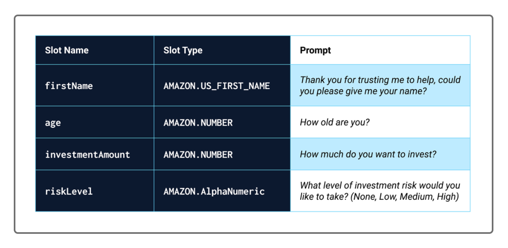
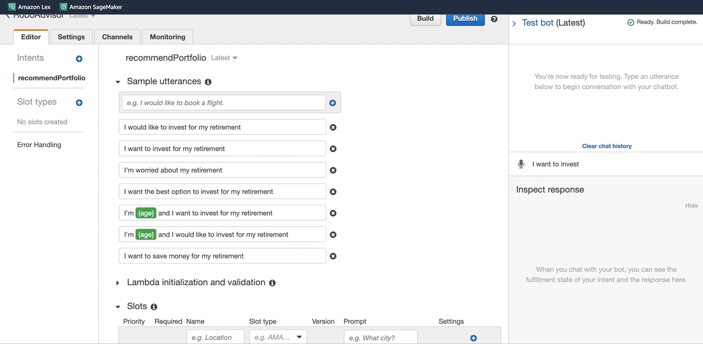
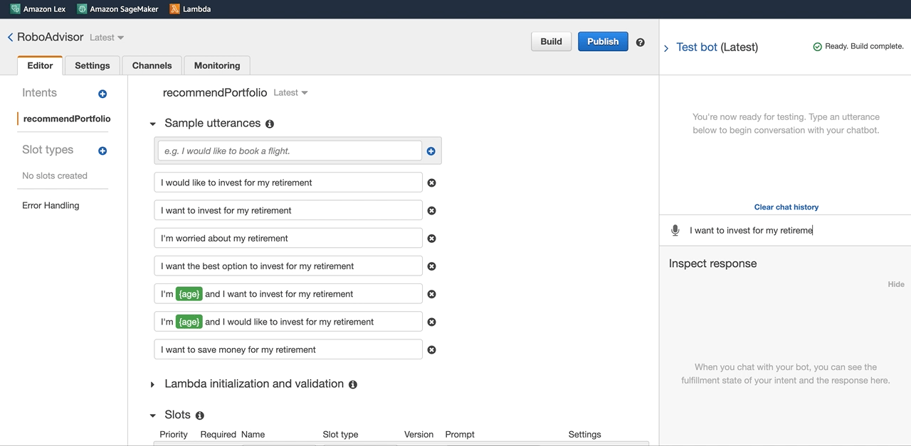
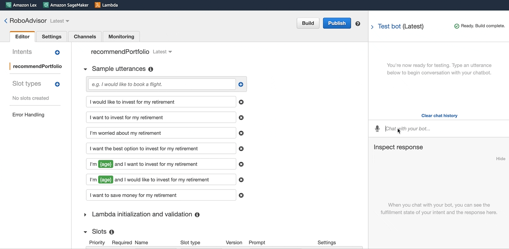
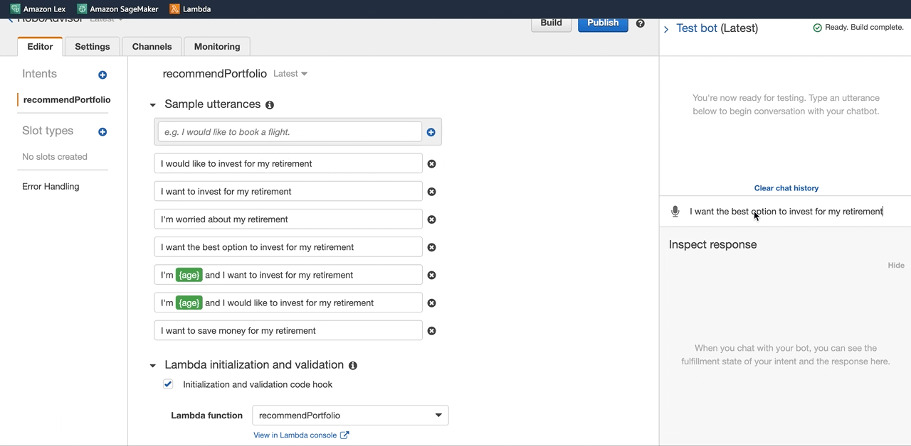

# Robo Portfolio Advisor

## Overview:

An AWS Lex chat bot that establishes a conversation with the user about investment requirements and risk appetite and uses AWS Lambda function to suggest an investment portfolio for retirement plan after validating user's inputs.

## Application process:

1. The Bot takes the following four inputs to save them as slots:



2. The bot responds with an investment recommendation based on the selected risk level, as follows:

- None: “100% bonds (AGG), 0% equities (SPY)”
- Low: “60% bonds (AGG), 40% equities (SPY)”
- Medium: “40% bonds (AGG), 60% equities (SPY)”
- High: “20% bonds (AGG), 80% equities (SPY)”

## Bot Working:






## Bot Test Validations:

* Age validation: upto 65 years
* Investment amount: More than 5000







## Technologies

This application leverages python 3.7 with the following modules

* datetime
* dateutil

This application further uses following AWS technologies:

* AWS Lex
* AWS Lambda


## Installation Guide

```
pip install python-dateutil
pip install DateTime
```

## Contributor

Shivangi Gupta

## License

MIT
